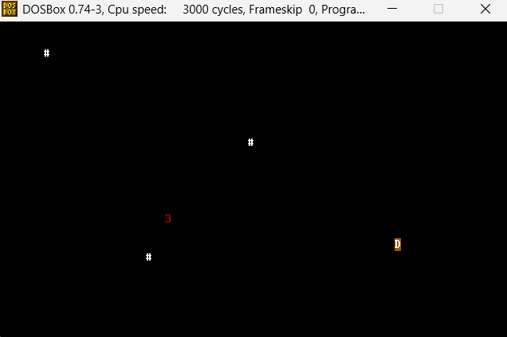
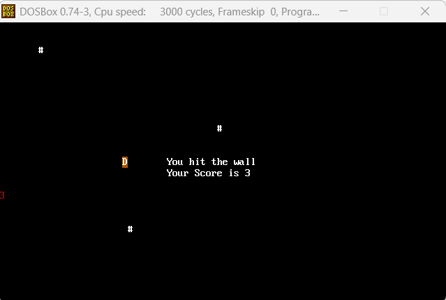

# x86 Assembly: Navigation Game

This repository features a low-level **16-bit real-time navigation game** written in **x86 Assembly**, developed as part of my Computer Engineering studies at Bar-Ilan University. The project demonstrates advanced concepts in hardware interfacing, interrupt handling, and direct system control.

### Technical Highlights
* **Custom ISR (Interrupt Service Routine):** Implemented a custom interrupt handler to manage asynchronous keyboard input (INT 09h), ensuring zero-lag responsiveness by interacting directly with the hardware.
* **Hardware Port Communication:** Direct interfacing with the **8042 Keyboard Controller (Ports 60h/64h)** for low-level scan code processing.
* **Real-Time Clock (RTC) Integration:** Utilized hardware **Ports 70h and 71h (CMOS)** to fetch real-time clock values, serving as a dynamic seed for pseudo-random coordinate generation.
* **Direct Video Buffer Mapping:** High-speed frame rendering achieved by bypassing standard BIOS interrupts and writing directly to the VGA text-mode buffer at segment **B800h**.

### Gameplay Visualization
The following screenshots demonstrate the game in action within a DOSBox environment:


*Figure 1: Active gameplay showing player movement and objective collection.*


*Figure 2: Game over screen displaying the final score after a collision.*

---

### Technical Details
* **Language:** x86 Assembly (MASM 6.11)
* **Mode:** 16-bit Real Mode
* **Environment:** DOSBox / FreeDOS
* **Filename:** nav_game.asm (Optimized for DOS 8.3 filename compatibility)

### How to Build and Run
To assemble and link the source files in a DOS environment:

1. **Assemble and Link:**
   ```bash
   ml /Zm nav_game.asm
2. **Execute:**
   ```bash
   nav_game.exe
